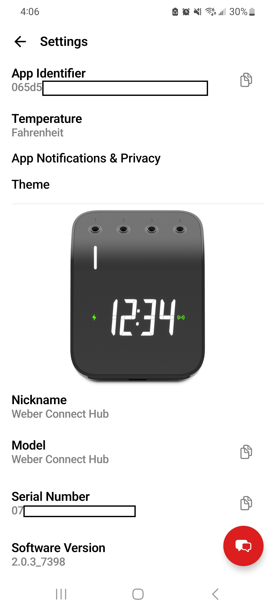

# Weber Connect (Cloud) — Home Assistant integration

Bring **Weber Connect** smart-grill probe temperatures into Home Assistant by
talking to Weber's cloud backend (walker-cloud / "June Cloud"). No local Bluetooth,
no extra hardware — once your hub is paired in the Weber Connect app and reporting
to the cloud, this integration polls the same APIs the app uses.

It was built clean-room from decrypted app traffic; the full wire protocol is in
[`docs/PROTOCOL.md`](docs/PROTOCOL.md).

## What you get

Per hub: a monitoring switch, an auto-off duration, a connection status, plus two
entities per probe channel (×4):

| Entity | Type | Values |
|--------|------|--------|
| `switch.<hub>_monitoring` | Switch | on / off — start/stop cloud polling |
| `number.<hub>_auto_off` | Number (config) | minutes the switch stays on before auto-off (default 60) |
| `sensor.<hub>_connection` | Enum (diagnostic) | `streaming` · `polling` · `stale` · `offline` · `off` |
| `sensor.<hub>_probe_N` | Temperature | Live probe temperature (°C/°F per your HA unit setting) |
| `sensor.<hub>_probe_N_status` | Enum (dropdown) | `disconnected` · `connected` · `idle` · `cooking` · `done` |

### Monitoring switch + auto-off

There's no reason to hammer Weber's cloud 24/7, so polling is **off by default** and
gated behind a switch:

- Turn **`switch.<hub>_monitoring`** on → the integration starts polling and arms an
  auto-off timer.
- **`number.<hub>_auto_off`** sets how long it stays on (default **60 minutes**).
- When the timer expires, the switch turns itself off, polling stops, and all probe
  entities go unavailable. Turn it back on before your next cook.

The switch exposes `minutes_remaining` as an attribute.

### Connection status

The **Connection** sensor reports the hub's overall data state — useful because the
hub only pushes to Weber's cloud intermittently, and when it pauses, probe data stops:

- **streaming** — companion websocket is delivering live frames (real-time doneness)
- **polling** — REST cook-history returned new snapshots this cycle (temps advancing)
- **stale** — a cook session exists but no new data arrived; the hub paused its push
- **offline** — no active cook session (hub isn't pushing a cook to the cloud)
- **off** — monitoring switch is off (not polling)

Its attributes break out the `rest` and `websocket` transports separately, plus the
session id and last snapshot id.

> **Probe entities are only available while the connection is `streaming` or
> `polling`** (live and accurate). In any other state — `stale`, `offline`, or
> `off` — the probe temperature and status entities report *unavailable* rather than
> showing a frozen/stale value.

The temperature sensor goes *unavailable* when a probe is unplugged or reads zero.
The **status** sensor is a text dropdown that always has a value:

- **disconnected** — probe unplugged / not reading, or no active cook
- **connected** — reading a temperature, but doneness is unknown (the companion
  websocket isn't streaming, which is common — see below)
- **idle** — plugged in, no target temperature set
- **cooking** — below the target temperature
- **done** — reached / exceeded the target

Connectivity (`disconnected` vs `connected`) is derived from the reliable REST
temperature feed. The finer `idle`/`cooking`/`done` states require the companion
websocket; if your hub doesn't stream over it, a reading probe simply shows
`connected`.

All entities are grouped under one **device** (your hub), with its name, model, and
serial number pulled from the cloud.

## How it works

- Polling only runs while the **monitoring switch** is on (with an auto-off timer);
  it's off by default.
- **Temperatures** come from the REST cook-history API (`/cook-history/.../snapshots`),
  polled every 10 s while monitoring is on. This is stateless, so it coexists fine
  with the phone app.
- **Connectivity** (`connected`/`disconnected`) is derived from whether a probe is
  reporting a temperature in the REST feed — reliable and always available.
- **Doneness** (`idle`/`cooking`/`done`) comes from the companion websocket, which
  only *refines* a connected probe. That channel is single-holder and many hubs
  don't maintain a cloud websocket session, so it's treated as best-effort: when it
  isn't streaming, reading probes stay `connected`.

## Requirements

- A Weber Connect Smart Grilling Hub (model 3201) **paired in the official Weber
  Connect app** and reporting to the cloud (the app shows live temps).
- Home Assistant 2024.1.0 or newer.
- Two credentials from your app's companion session — see below.

## Getting your credentials

This integration logs in as a **companion device** using two values that the Weber
app stores after you pair the hub:

- `device_id` — your companion device ID (a 32-hex-char string, e.g. `065d…`).
- `device_password` — the matching device password.

### Where to find this in the app

Open the Weber Connect app → **Settings**. The screen below shows the relevant fields:

<p align="center">
  
</p>

- **App Identifier** is your **`device_id`** — copy it straight from this screen (use
  the copy icon next to it). No capture needed for this one.
- **Serial Number** and **Model** are shown here too (the integration also reads these
  from the cloud automatically, so you don't have to enter them — this is just where to
  see/confirm them).

The **`device_password`** is *not* shown in the app UI. You extract it once from a
decrypted capture of the app's login traffic (the `POST /2/devices/register` call). The
project tooling in [`tools/`](tools/) and the notes in [`docs/`](docs/) walk through
capturing and decrypting that traffic (PCAPdroid + mitm on Android). Keep it private —
the `device_password` is a real secret.

> The OAuth `client_id` / `client_secret` are **app-global** values baked into the
> Weber app (identical for every install, extracted from the APK), so they ship
> embedded in the integration — you do not provide them. They are not personal secrets.

## Installation

### HACS (recommended)

1. In HACS → **Integrations** → ⋮ menu → **Custom repositories**.
2. Add this repo's URL, category **Integration**.
3. Find **Weber Connect (Cloud)** in HACS, install it.
4. Restart Home Assistant.
5. **Settings → Devices & Services → Add Integration → "Weber Connect"**, then enter
   your `device_id` and `device_password`.

### Manual

Copy [`custom_components/weber_connect/`](custom_components/weber_connect/) into your
HA `config/custom_components/` directory so you have
`config/custom_components/weber_connect/manifest.json`, then restart HA and add the
integration as in step 5 above.

## Testing it

1. Start a cook in the Weber app and confirm live temps appear there.
2. Add the integration in HA with your credentials. If login fails you'll get a clear
   error (bad creds vs. no paired grill vs. cloud unreachable).
3. Check **Settings → Devices & Services → Weber Connect → your hub**. You should see
   8 entities (4 probes × temperature + status).
4. Plug a probe into hot water with a target set → status should move
   `idle → cooking → done`; unplug it → `disconnected`.

If something looks off, enable debug logging:

```yaml
# configuration.yaml
logger:
  default: warning
  logs:
    custom_components.weber_connect: debug
```

## Repo layout

```
custom_components/weber_connect/   # the Home Assistant integration (this is what HACS installs)
  api.py            # blocking stdlib cloud client (REST + companion websocket)
  coordinator.py    # DataUpdateCoordinator: polls snapshots + reads doneness
  sensor.py         # per-probe temperature + status (enum) sensors
  config_flow.py    # UI setup: device_id + device_password
  const.py          # domain, app-global client creds, poll cadence
hacs.json           # HACS metadata

src/weber_connect/  # standalone research library (reference implementation)
  protocol.py       # pure wire-format decoders (HTTP, websocket frames, TLVs)
  client.py         # WeberConnectClient: auth, snapshots, ws discovery
tools/              # CLIs used to validate against the live cloud (validate.py, monitor.py, …)
tests/              # offline decoder tests against captured fixtures
docs/               # PROTOCOL.md (wire spec) + reverse-engineering notes
```

## Standalone library / CLI

The `src/weber_connect` package and `tools/` scripts are the original PC-side
reverse-engineering work and double as a reference implementation:

```bash
python tests/test_offline.py                 # prove decoders against captured data
python tools/validate.py token               # mint an access token
python tools/monitor.py                       # live REST poller (temps over a cook)
```

Put credentials in `secrets.local.json` (copy `secrets.example.json`) — it is
gitignored.

## License

See [`LICENSE`](LICENSE).
